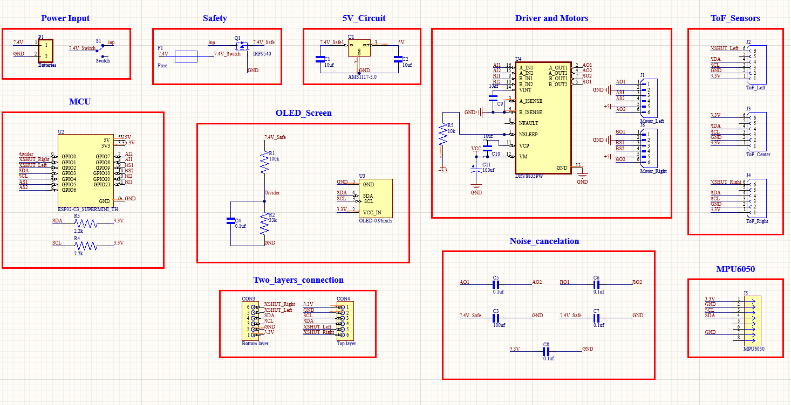
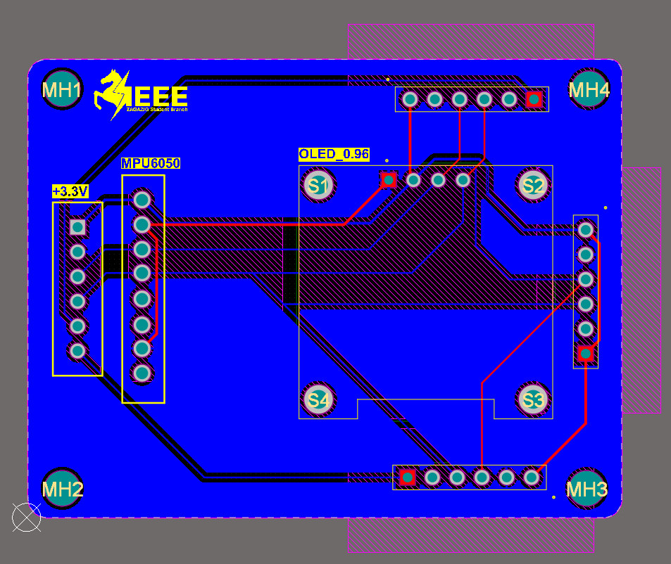
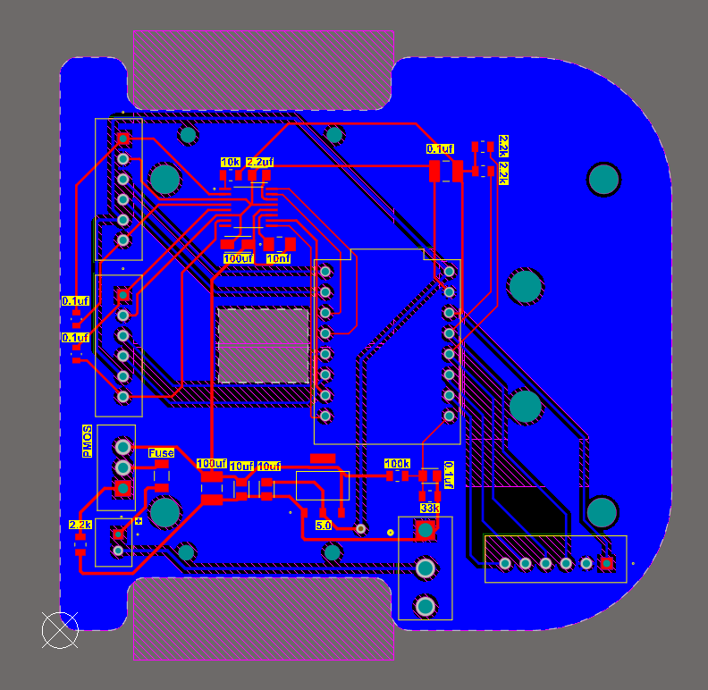
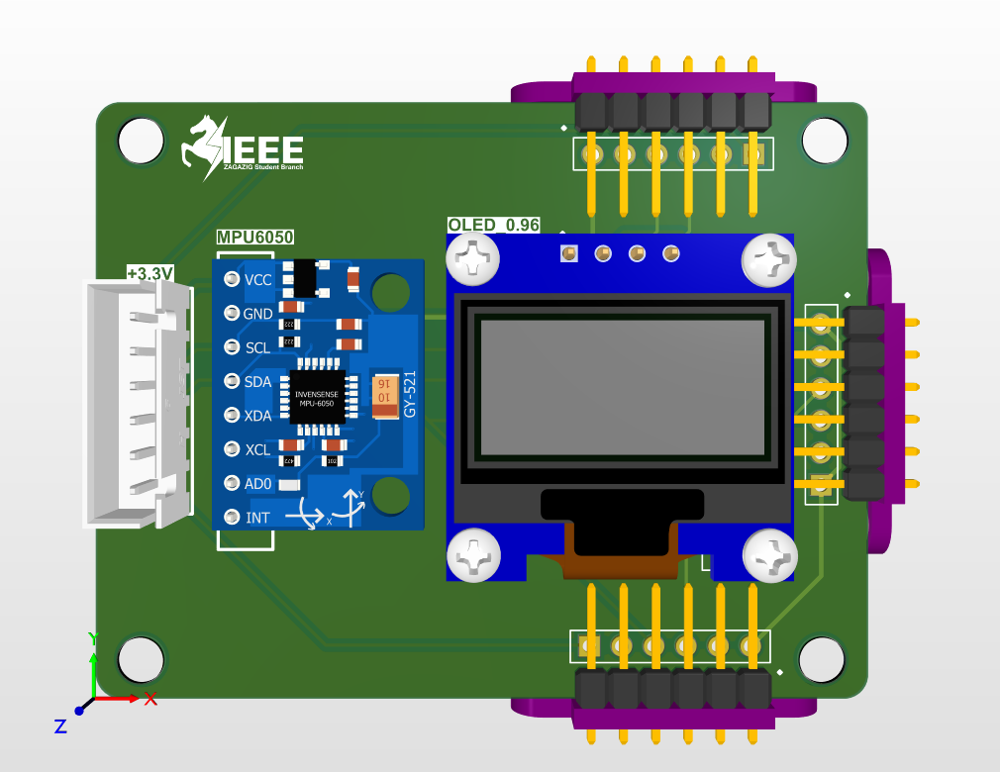
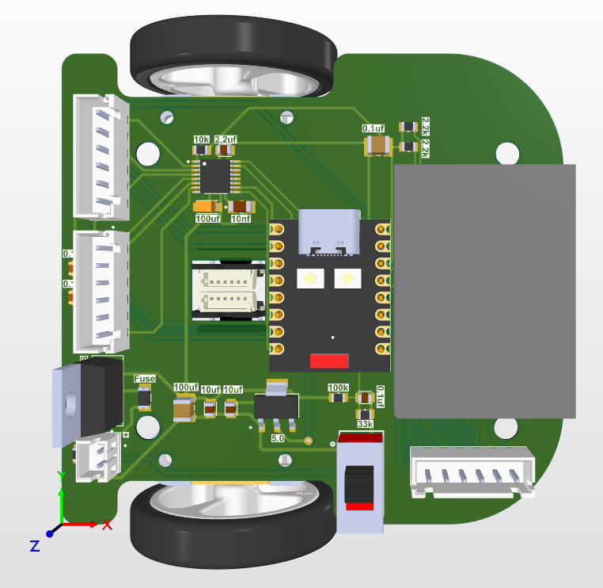
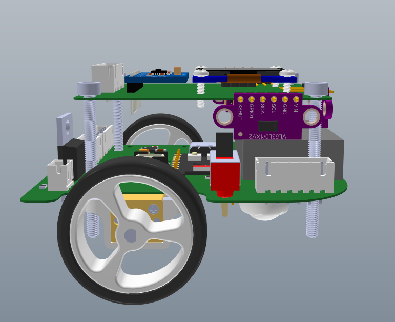
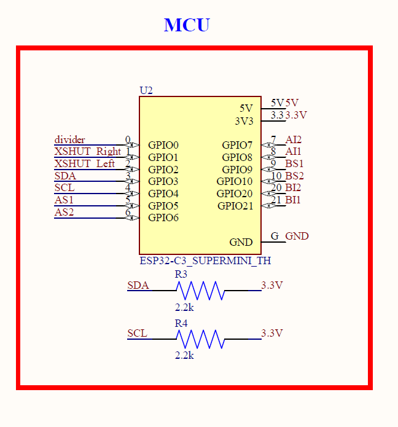
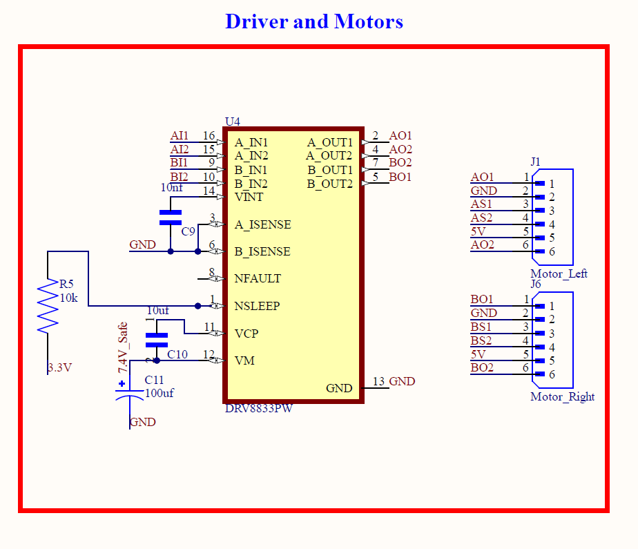

# Micromouse — Autonomous Maze-Solving Robot

**🥈 2nd Place — IEEE ZSB RAS Chapter, PCB Design Track Final Project**

An autonomous maze-solving micromouse robot, designed end-to-end in Altium — from schematic
and PCB layout through calculations and full engineering documentation — as the capstone
project for the IEEE Zagazig Student Branch, Robotics & Automation Society chapter's PCB
Design track.

---

## Overview

The robot must detect obstacles, plan its path, and adapt to a maze autonomously, while staying
within a strict **11cm × 11cm** PCB footprint. The design is split across **two stacked PCB
floors**, connected by a single 6-pin interconnect, to fit that size constraint while
physically separating noise-sensitive sensor circuitry from higher-current motor/power
circuitry — a deliberate noise-mitigation strategy baked into the architecture itself, not
patched on afterward.

## Full Schematic



Ten functional blocks: Power Input, Safety (protection), 5V regulation, ESP32-C3 MCU, DRV8833
driver and motors, three ToF sensor headers, MPU6050, OLED display, motor-noise cancellation,
and the two-floor interconnect.

## Key Components

| Component | Role | Why This Part |
|---|---|---|
| ESP32-C3 Super Mini | Microcontroller | 13 usable GPIOs — an exact match to this design's requirement, ~3.8× smaller footprint than a standard 30/38-pin ESP32 DevKit |
| 3× VL53L0X | Time-of-Flight distance sensors (front/left/right) | Millimeter-accurate digital readings unaffected by wall color, smallest available package |
| MPU6050 | 6-axis IMU | Gyro yaw-rate feedback for confirming 90° turn completion |
| DRV8833 (bare IC) | Dual motor driver | HTSSOP-16 bare IC instead of breakout module — ~10-15× smaller footprint |
| 2× N20 micro gear motors | Drive + quadrature encoder feedback | 300mA stall current (datasheet-confirmed), encoder feedback for closed-loop turning |
| 0.96" OLED (SSD1306) | Status + battery percentage display | Shares the existing I2C bus — no extra pins |
| 2× 3.7V LiPo cells (series) | 7.4V, 1000mAh power source | Individually protected cells, charged separately |

## PCB Layout

| Top Floor (Sensors) | Bottom Floor (Power, MCU, Motor Driver) |
|---|---|
|  |  |

The bottom floor's motor mounting uses **edge notches cut directly into the board outline**,
letting each motor's gearbox body share vertical space with the PCB itself rather than hanging
entirely below it — reducing total stack height versus a conventional underneath-mounted motor.

## 3D Render — Top Floor





## Schematic Detail

| MCU & Pin Assignment | Motor Driver & Noise Suppression |
|---|---|
|  |  |

## Architecture

- **I2C bus** shared by 5 devices (3× ToF, IMU, OLED). ToF sensors are individually addressed
  via XSHUT sequencing at boot — one sensor's XSHUT is hardwired to 3.3V and keeps the factory
  default address, while the other two are held in reset and reassigned unique addresses in
  firmware, saving a GPIO versus controlling all three.
- **Power chain:** Battery → fuse → reverse-polarity protection (P-channel MOSFET) → splits to
  the motor driver directly (bypassing regulation for efficiency) and to a 5V linear regulator
  for logic.
- **13/13 GPIO budget**, solved with zero spare pins: motor driver signals were deliberately
  assigned to the ESP32's BOOT-strapping pin (GPIO9) instead of encoder inputs, since a
  firmware-driven output can't glitch the boot sequence the way an unpredictable encoder input
  state could.
- **Noise mitigation:** motor suppression capacitors at the source, bulk + local decoupling at
  every IC, a solid ground plane on both floors, and the physical floor-split itself keeping
  the motor driver's switching noise away from the I2C bus and analog battery-sense line.

## Engineering Process — A Few Real Bugs We Caught

Documenting this honestly, since catching these was as much a part of the project as the final
design:

- **A net-label typo left the motor driver's sleep pin floating** (`+3.3` vs. `3.3V` — two
  different nets to Altium despite looking almost identical) — caught via ERC, not visual
  inspection.
- **Two DRV8833 support capacitor values were transposed** in the schematic (the charge-pump
  cap and the VINT bypass cap swapped values) — caught by cross-checking every value against
  the datasheet's specific requirements rather than just confirming a capacitor existed on each
  net.
- **A motor encoder signal was initially assigned to GPIO9** (the BOOT-strapping pin) — since
  an encoder's state at power-on is essentially random depending on wheel position, this could
  have caused intermittent boot failures. Reassigned to a motor-driver output pin instead.

## Repository Structure

```
hardware/   → Altium project (schematics, PCB layout, 3D)
docs/       → Bill of Materials, full calculations (trace widths, power budget,
              MCU justification, battery lifetime), presentation
media/      → Schematic/PCB/3D screenshots and project photos
```

## Documentation

- 📐 [Bill of Materials](docs/Micromouse_BOM.pdf)
- 🧮 [Calculations — Trace Width, Power, MCU Justification, Battery Lifetime](docs/Micromouse_Calculations.pdf)
- 🎞️ [Presentation](docs/Team_A.pdf)

## Verification

- ✅ Zero ERC errors, both schematic sheets
- ✅ Zero DRC errors, both PCB floors
- ✅ Every trace width calculated against the IPC-2221 standard with 2×–30× safety margin over
  the calculated minimum

## Team

- Abdallah Ahmed
- Mohamed Hany
- Malak Mahdi

## Acknowledgments

Thank you to the IEEE ZSB RAS chapter leadership for the guidance and structure throughout this
track, and to everyone who made this competition possible.